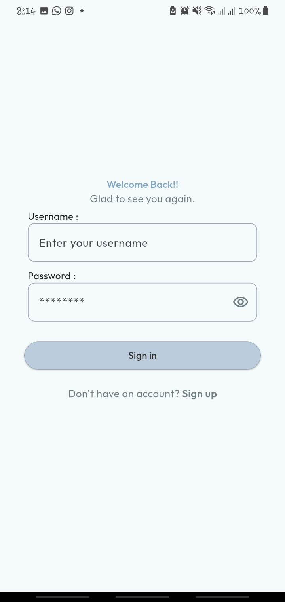
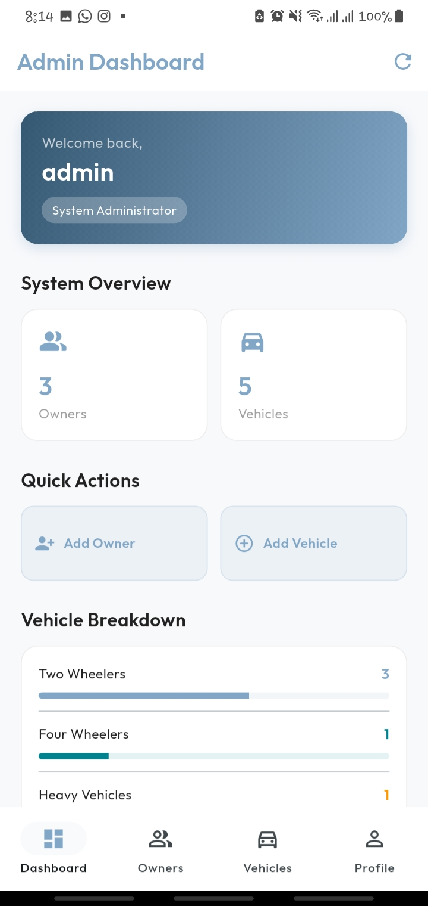
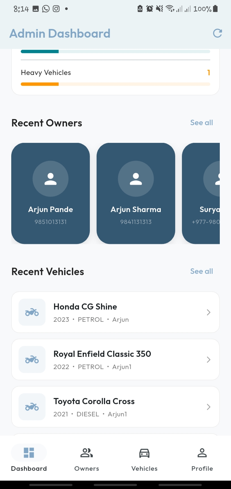
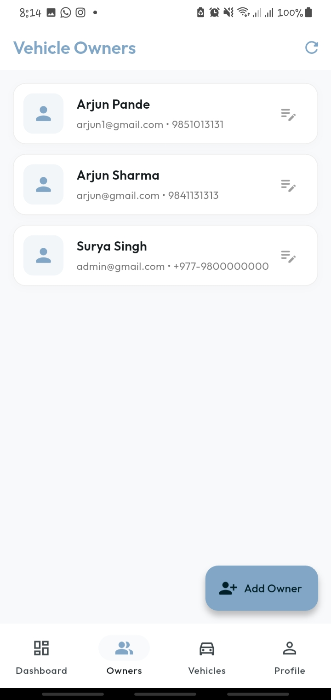
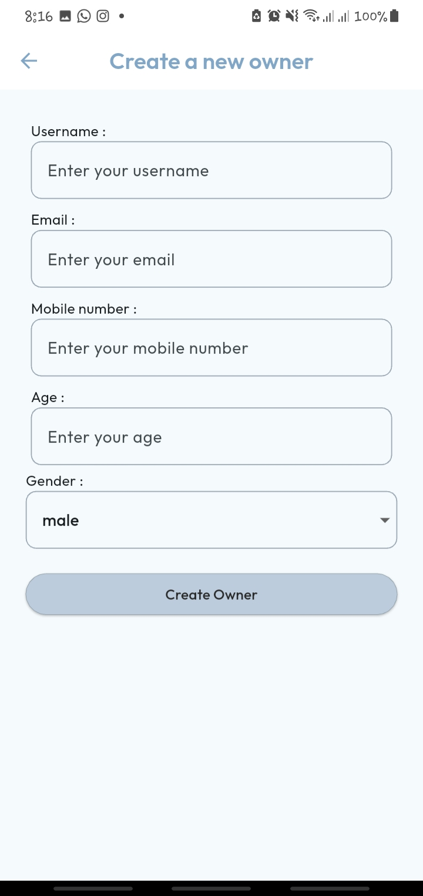
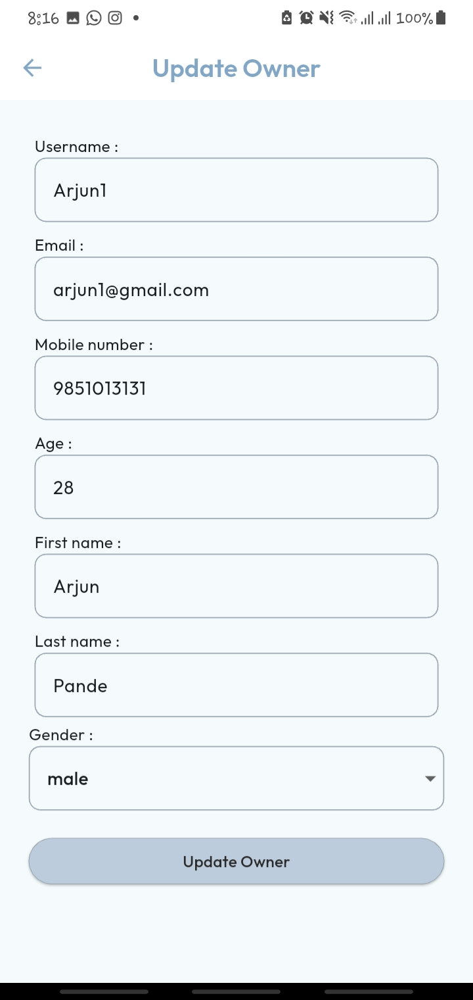
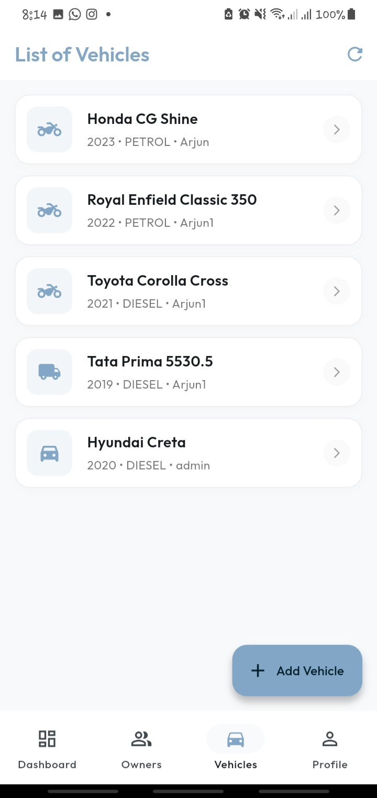
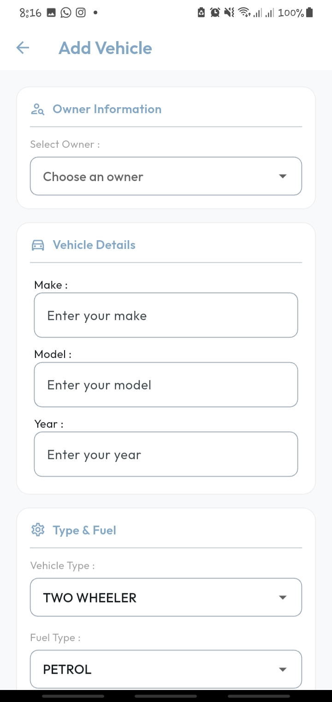
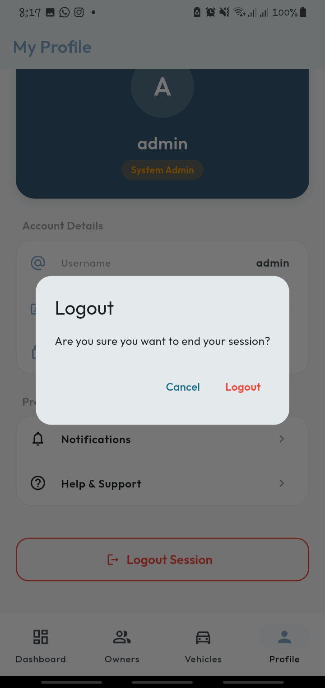

## Moto Manage 🏍️
A simple Vehicle Management System (VMS) built with Flutter. This app connects to a Django REST API to perform CRUD operations on vehicle owners and their vehicles. It was built as a learning project to understand API integration, clean architecture, and Flutter development concepts.

## Screenshots

<p align="center">
  
  
  
</p>

<p align="center">
  
  
  
</p>

<p align="center">
  
  
  
</p>

---

## What This App Does

- **Create Owners** — Add new vehicle owners with details like name, contact, and gender
- **Add Vehicles** — Register vehicles and link them to specific owners
- **List Owners & Vehicles** — View all owners and vehicles in a clean list
- **Owner-Vehicle Link** — Tap an owner to see all vehicles owned by them
- **Update Details** — Edit owner and vehicle information
- **Admin Login** — Secure login for administrators

> **Note:** Accounts created through the signup screen do not create valid login credentials. Admin login is handled separately.

---
## What I Learned

- **API Integration** — Connecting Flutter app to Django REST Framework backend
- **Clean Architecture** — Separating code into Presentation, Domain, and Data layers
- **Reusable Widgets** — Building custom widgets used across multiple screens
- **Authentication & Tokens** — Handling login sessions and secure API requests
- **Form Validation** — Validating user input before sending to server
- **CRUD Operations** — Create, Read, Update, Delete via REST API
- **Dependency Injection** — Managing dependencies with `get_it`
- **Declarative Routing** — Navigation using `go_router`
- **State Management** — Managing UI state during API calls and data changes

---

### 🛠️ Tech Stack & Key Dependencies
- Framework              : Flutter
- Navigation             : go_router - declarative routing with path parameters
- Networking             : http - RESTful API communication
- Dependency Injection   : get_it - service locator pattern
- Backend                : Django REST Framework (DRF)

### 🏗️ Architecture
This project follows Clean Architecture with a Feature-First folder structure. Each feature is fully self-contained with its own data, domain, and presentation layers.
```
lib/
├── core/
│   ├── constants/
│   │   └── api_constants.dart        # Base URL and endpoint constants
│   └── di/
│       └── service_locator.dart      # get_it — single wiring file for the whole app
│
└── features/
├── owner_management/
│   ├── data/
│   │   ├── data_sources/         # Raw HTTP calls (OwnerRemoteDataSource)
│   │   ├── models/               # JSON ↔ Dart conversion (OwnerModel)
│   │   └── repositories/         # Implements domain interface (OwnerRepositoryImpl)
│   ├── domain/
│   │   ├── entities/             # Pure Dart objects — no imports (OwnerEntity)
│   │   ├── repository_interfaces/ # Abstract contracts (OwnerRepository)
│   │   └── usecases/             # Single-responsibility actions (GetOwnersUseCase)
│   └── presentation/
│       ├── pages/                # Screens (OwnerScreen, CreateOwnerScreen)
│       ├── state_management/     # ChangeNotifiers / Cubits
│       └── widgets/              # Reusable UI components
│
└── vehicles_management/
    ├── data/
    │   ├── data_sources/         # VehicleRemoteDataSource
    │   ├── models/               # VehicleModel
    │   └── repositories/         # VehicleRepositoryImpl
    ├── domain/
    │   ├── entities/             # VehicleEntity
    │   ├── repository_interfaces/ # VehicleRepository
    │   └── usecases/             # GetVehiclesUseCase, GetVehiclesByOwnerUseCase
    └── presentation/
    ├── pages/                # VehiclesScreen, VehiclesByOwnerScreen
    ├── state_management/
    └── widgets/
```


### 📱 Features Implemented
FeatureStatus
- List all owners from API
- Create new owner with form validation
- List all vehicles
- List vehicles filtered by owner
- Dropdown gender selection
- SnackBar feedback on API success/failure
- Loading indicator during API calls
- Clean Architecture - full layer separation
- Dependency injection with get_it
- Centralised routing with GoRouter

---
### 🔧 Running the Project

Ensure your Django backend is running locally
Update `lib/core/constants/api_constants.dart` with your machine's local IP:

```
static const String baseUrl = 'http://192.168.x.x:8000/api';
```

On Android, confirm AndroidManifest.xml has:

 ```
 android:usesCleartextTraffic="true"
 ```
Run the app:

 ```    
 flutter pub get
 flutter run
 ```
